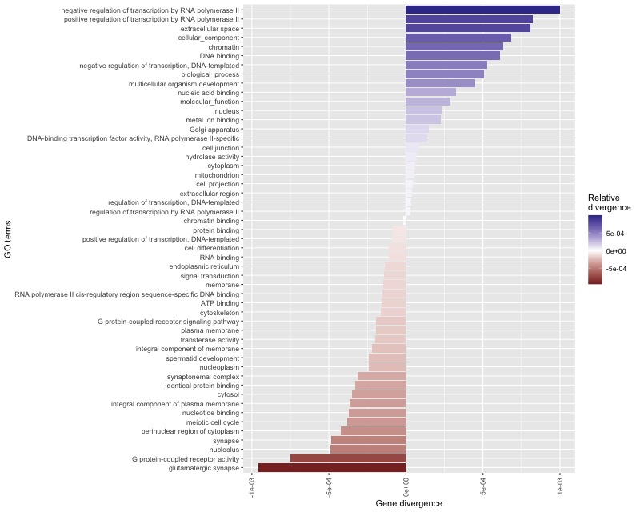

# Mouse Gene Ontology enrichment analysis pipeline

This repository represents a bioinformatic pipeline to carry Gene Ontology enrichment analysis for low and high divergence genes among two house mouse subspecies. The pipeline is used as an exercise at the course on UNIX and work with genomic data.

## Overview

SNP variants for two mouse strains (PWD/PhJ, WSB/EiJ) were downloaded from the Mouse Genome Project FTP site [Mouse Genome Project](https://www.sanger.ac.uk/data/mouse-genomes-project/). PWD/PhJ and WSB/EiJ represent Mus musculus musculus and Mus musculus domesticus subspecies, respectively.

The aim is to identify genes with high relative divergence between the two strains and carry Gene Ontology enrichment analysis for genes according to the divergence.

## Run the pipeline

#### Test & install required software

If `bedtools`, `vcftools` or `bcftools` are not installed, the script below will install these tools.

```bash
bash install.sh
```

#### Define variables

```bash
# Filtering parameters
QUALITY=50
READDEPTH=10
MINNUMGENES=9

# Working directories (removed from the git in .gitignore)
WD_SOURCE=data/00-source-data
WD_DIVERGENCE=data/01-divergence
WD_GO=data/02-go

# Source files
SOURCEVCF=$WD_SOURCE/mgp.v5.snps.dbSNP142.clean.X.vcf.gz
SOURCEGENES=$WD_SOURCE/MGI.gff3.gz
GO2GENES=$WD_SOURCE/gene_association.mgi.gz
GOTERMS=$WD_SOURCE/go_terms.mgi.gz

# Helping datasets
CDS_DB=$WD_SOURCE/mgi-cds.bed
GO_DB=$WD_SOURCE/go2genes.txt

# Output files
ANNOTATION=$WD_DIVERGENCE/annotation.tab
DIV_VCF=$WD_DIVERGENCE/out-vars.vcf
DIV=$WD_DIVERGENCE/divergence.bed
DIV_GO=$WD_GO/divergence_by_go.txt
```

#### Prepare data

```bash
# Prepare CDS database
bash src/make_cds_database.sh $SOURCEGENES $CDS_DB

# Prepare GO database
bash src/make_go_dataset.sh $GO2GENES $GOTERMS $GO_DB
```

#### Run the pipeline

```bash
bash pipeline.sh \
$QUALITY \
$READDEPTH \
$MINNUMGENES \
$SOURCEVCF \
$ANNOTATION \
$DIV_VCF \
$CDS_DB \
$DIV \
$GO_DB \
$DIV_GO
```

## Detailed description of the pipeline

#### 1. Selecting SNPs that are divergent between the two strains

Other criteria used for selection is the PHRED quality and read depth (DP). Divergent SNPs are identified using Fst function built in the `vcftools`. SNPs are considered to be divergent when Fst equals 1.

```bash

DIVERGENCEVCF=out-vars.vcf

bash src/get_divergent_variants.sh \
$QUALITY \
$READDEPTH \
$WORKINGDIR \
$SOURCEVCF \
$DIVERGENCEVCF
```

#### 2. Prepare CDS database

`MGI.gff3.gz` represents a full report containing detailed information on genes, mRNAs, exons and CDS. For the divergence analysis only CDS are needed. CDS database is prepared in this step and `gff3` is converted to `bed` to work more easily with the CDS data.

```bash

WORKINGDIR=data/01-divergence


bash src/make_cds_database.sh \
$SOURCEGENES \
$WORKINGDIR \
$CDSDB
```

#### 3. Calculate the per gene divergence

Once the list of divergent SNPs between the two strains and the CDS database are created, the divergence per gene can be calculated. Combination of `bedtools` tools and `awk` commands is used to find SNPs overlapping CDS parts of the genes and calculate sums and relative divergence by genes.

```bash
DIVERGENCE=divergence.bed

bash src/calculate_per_gene_divergence.sh \
$WORKINGDIR \
$DIVERGENCEVCF.gz \
$CDSDB \
$DIVERGENCE
```

#### 4. Calculate the average relative divergence by Gene Ontology category

Per-gene relative divergences are used to calculate the average relative divergence for individual GO terms. Combinatino of the built-in UNIX `join` and `sort` commands is used along with `groupby` that is part of the `bedtools` tools suite. Dataset representing association between genes and GO terms provided by Mouse Genome Informatics [Mouse Genome Informatics](http://www.informatics.jax.org) and Gene Ontology Consortium [Gene Ontology](http://geneontology.org) is joined to dataset on with gene relative divergences. The average for every GO term is then calculated omitting low prevalence GO terms.

```bash

DIVERGENCE=data/01-divergence/divergence.bed
DIVBYGO=divergence_by_go.txt
WORKINGDIR=data/02-go
MINNUMGENES=9

bash src/divergence_by_go.sh \
$GO2GENES \
$GOTERMS \
$DIVERGENCE \
$DIVBYGO \
$WORKINGDIR \
$MINNUMGENES
```

#### 5. Prepare a barplot showing results of the GO enrichment analysis

To plot the results of the GO enrichment analysis `Rscript` is used. Library `ggplot2` is the most suitable tool to provide fast and efficient plot.

```bash
Rscript src/plot.R
```

